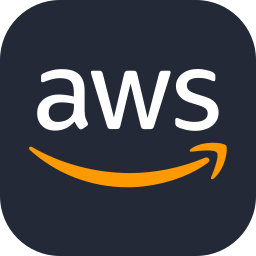
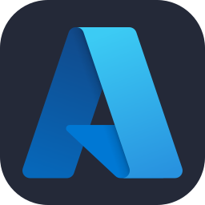

# Hola, soy Brandon 👋

### Desarrollador Full Stack |  Aplicaciones Web · IA .Automatizaciones

Soy Desarrollador Full Stack con 4 años de experiencia, enfocado en crear y mejorar aplicaciones web que resuelvan necesidades
reales del negocio. He trabajado en la modernización de sistemas, desarrollo de APIs , microservicios, automatización de procesos y
optimización de aplicaciones, logrando mejoras de hasta 60% en rendimiento y ahorros de 20+ horas semanales. Tengo experiencia
en todo el ciclo de desarrollo, desde el diseño de bases de datos hasta testing y despliegue, actualmente estoy profundizando en IA
aplicada al desarrollo de software.

---

## 🚀 ¿Qué desarrollo?

- Aplicaciones Web Full Stack
- Productos SaaS
- APIs REST y sistemas Backend
- CRMs y aplicaciones empresariales
- Soluciones impulsadas por IA
- Integraciones con servicios externos (microservicios)

---

## 🛠️ Stack tecnológico

### Frontend

   

### Backend

  

### Bases de datos

  

### Cloud & Herramientas

     

### Inteligencia Artificial

APIs de IA · LLMs · Integración de IA en aplicaciones

---

## 💼 Experiencia

### R&C Consulting
**Desarrollador Full Stack**

Desarrollo de un CRM para la gestion de usaurios en la plataforma incluyendo
roles , permisos y planes .

### Protecta Security
**Desarrollador Full Stack**

Desarrollo de aplicaciones para digitalización de procesos de seguros,
APIs REST, bases de datos e integraciones con servicios externos.

### BigPrime
**Desarrollador Full Stack**

Desarrollo de microservicios para plataformas internas , testing 
y optimizacion de recusos asi como pruebas de despliegue en produccion.

---

## 🚀 Proyectos destacados

### 🎓 SanMarcosGo

Plataforma educativa para estudiantes que se preparan para ingresar a la
universidad, con banco de preguntas, simulacros en tiempo real y
funcionalidades impulsadas por IA.

https://sanmarcosgo.com

**·Next.js · Tailwind CSS · Cloudflare(AWS) · PostgreSQL . PrismaORM . Supabase . Culqui . OpenAI GPT-4**

### 🤖 Bot de ventas inteligente

Sistema de mensajería inteligente orientado a mejorar la interacción
con clientes y apoyar procesos comerciales mediante IA.

**Next.js · Node.js · TypeScript · PostgreSQL · Cluaude**

### 🎬 AI Video SaaS

Producto SaaS enfocado en la creación de contenido mediante Inteligencia
Artificial para generar videos orientados a alcance y conversión.

https://viral-flowy.vercel.app

**Next.js · Tailwind . GSAP . Three .  OpenAI(GPT-4 y DALL-E 3). PayPal SDK · PostgreSQL . PrismaORM  ·Supabase**

---

## 📊 GitHub

![GitHub Stats] https://github.com/BrandonDevAI

---

## 📫 Contacto

🌐 **Portafolio:** https://brandon-dev.vercel.app/

📧 **Email:** brandonmillonaire08@gmail.com

💬 **WhatsApp:** +51 954309429

---

### Construyendo productos digitales, aprendiendo constantemente y
explorando nuevas posibilidades con IA.
